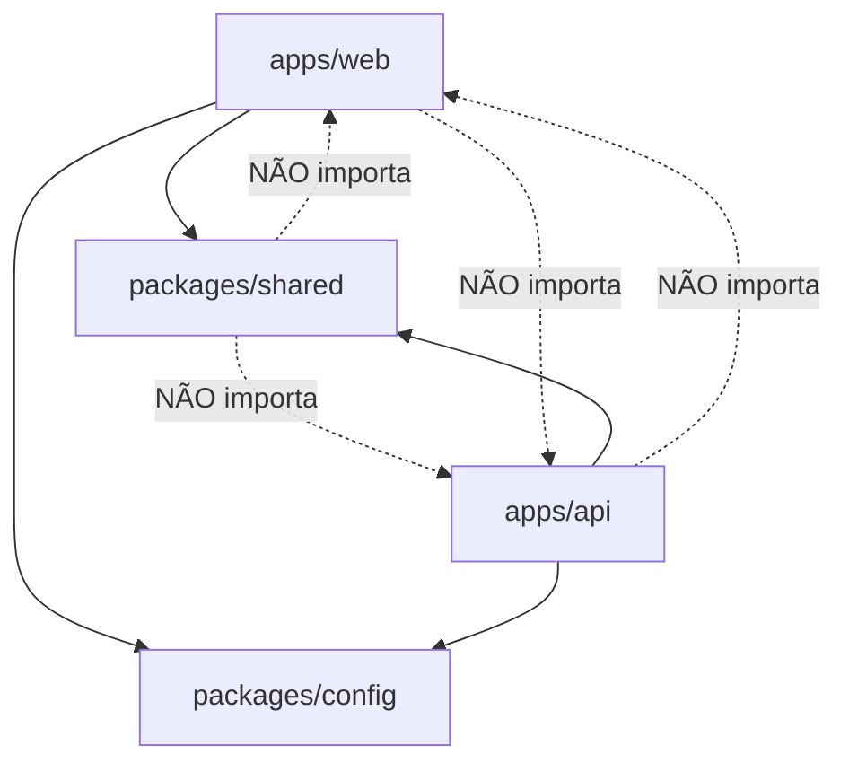

# ADR-0001 — Monorepo pnpm + Turborepo e boundaries

- **Status:** Aceito
- **Data:** 2026-08-06
- **Decisores:** ARCHITECT (Bloco A), em alinhamento com ORCHESTRATOR
- **Bloco:** A — Fundação

## Contexto

O plugga-os é um web app (Next.js) + API (NestJS) que compartilham contratos
(DTOs, enums, nomes de evento) e precisam de tooling único (TypeScript, lint,
testes, CI). O PRD (§13, §14) e o diagnóstico (§7) pedem um produto navegável cedo,
com contratos claros para agentes e integrações, e "preferir menos módulos bem
definidos a monólito genérico" (PRD princípio 10).

Sem um repositório único, contratos entre web e API divergem, versionar fica
custoso e o onboarding piora. Precisamos de uma estrutura que force boundaries
explícitos entre aplicações e pacotes compartilhados desde o dia 1.

## Decisão

Adotar um **monorepo único** gerenciado por **pnpm workspaces** + **Turborepo**.

Estrutura de topo:

```text
plugga-os/
├── apps/
│   ├── web/            # Next.js (shell, telas, mocks)
│   └── api/            # NestJS (monólito modular — ver ADR-0002)
├── packages/
│   ├── shared/         # contratos: tipos, DTOs, enums, nomes de evento
│   └── config/         # base tsconfig / eslint / prettier compartilhados
├── docs/               # PRD, ADRs, guias de agente
├── pnpm-workspace.yaml
├── turbo.json
└── package.json        # scripts raiz (build/test/lint/dev)
```

### Regras de dependência (boundaries)



1. `apps/*` **podem** depender de `packages/*`. `packages/*` **nunca** dependem de `apps/*`.
2. `apps/web` e `apps/api` **não** se importam diretamente; comunicam-se via HTTP
   e pelos contratos em `packages/shared`.
3. `packages/shared` é **livre de framework e de runtime pesado**: só tipos, enums,
   schemas de validação (Zod) e constantes de contrato. Sem NestJS, sem Next, sem
   acesso a banco, sem segredos.
4. `packages/config` guarda apenas configuração de tooling (tsconfig base, regras
   de eslint/prettier). Sem lógica.
5. O que `apps/api` expõe para `apps/web` é sempre um contrato publicado em
   `packages/shared` (nunca um import de código interno da API).

### Tooling

- **pnpm** como package manager (workspaces, store eficiente, `--frozen-lockfile` no CI).
- **Turborepo** para orquestrar `build`, `lint`, `typecheck`, `test` com cache e
  `dependsOn: ["^build"]`.
- Boundaries reforçados por lint (ex.: `eslint-plugin-import` /
  `no-restricted-imports`) para impedir imports proibidos entre camadas.
- Node LTS fixado (`.nvmrc` / `engines`); versão de pnpm fixada em `packageManager`.

## Consequências

**Positivas**
- Contrato único entre web e API; mudança de DTO quebra o build de quem depende.
- CI e cache incrementais; PRs pequenos e verificáveis (alinha ao plano de entrega).
- Onboarding com um único `pnpm install` na raiz.

**Negativas / custos**
- Disciplina de boundaries precisa ser reforçada por lint, senão o monorepo vira
  "big ball of mud".
- Turborepo adiciona uma camada de configuração de pipeline a manter.

**Neutras**
- Deploy continua independente por app (web e api são artefatos separados).

## Alternativas consideradas

| Alternativa | Por que não agora |
|---|---|
| Multi-repo (web e api separados) | Divergência de contratos e overhead de versionamento; contraria "produto navegável cedo". |
| Nx | Mais poderoso, porém mais opinativo e pesado que o necessário para 2 apps + 2 packages. |
| npm/yarn workspaces sem Turbo | Sem cache/orquestração de pipeline; CI mais lento. |

## Gatilhos de revisão

- Surgir um terceiro app (ex.: worker dedicado) ou muitos packages → reavaliar
  Turborepo vs Nx.
- Necessidade de publicar `packages/shared` externamente → adicionar versionamento
  (changesets).

## Guardas de escopo

- Nenhum scaffold mecânico ou código de domínio é decidido aqui — apenas a
  estrutura e as regras de boundary.
- Nada neste ADR toca sistemas em produção, crons ou segredos.
