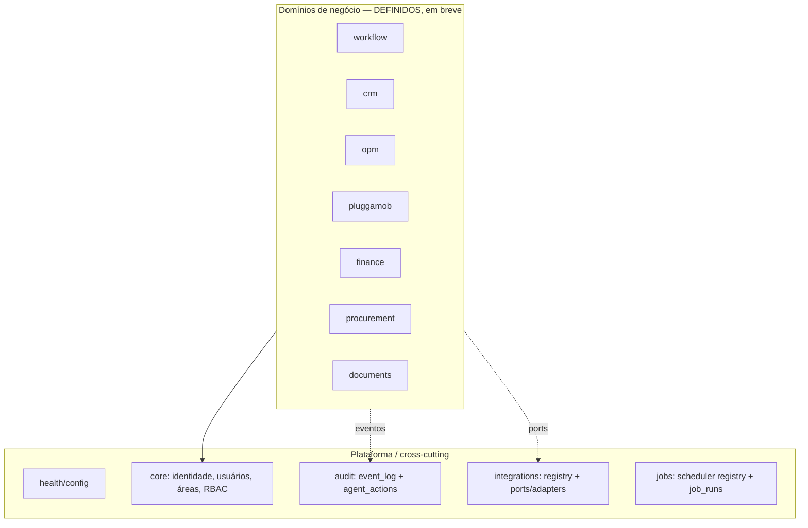

# ADR-0002 — Next.js + NestJS como monólito modular

- **Status:** Aceito
- **Data:** 2026-08-06
- **Decisores:** ARCHITECT (Bloco A), em alinhamento com ORCHESTRATOR
- **Bloco:** A — Fundação

## Contexto

O PRD (§13, §14) e o diagnóstico (§7.3) recomendam **Next.js** no frontend e
**NestJS** no backend (alternativa FastAPI descartada por preferência operacional
do time em TypeScript + Cursor). O produto tem muitos domínios (Core/Workflow, CRM,
OPM, PluggaMob, Financeiro, Compras, Integrações, Agentes, Documentos), mas o MVP
deve começar pequeno e crescer por domínio, com cutover controlado.

A tentação de "arquitetura distribuída" (microserviços, fila de eventos externa)
é explicitamente rejeitada pela restrição do bloco: **sem Kafka, sem Kubernetes,
sem microserviços**. Precisamos de modularidade forte **dentro** de um único
deployable.

## Decisão

Construir a API como um **monólito modular NestJS**: um único processo/deployable,
organizado em **módulos de domínio** com boundaries explícitos. O frontend é um
único app **Next.js** (desktop-first, App Router).

### Mapa de módulos da `apps/api`

**Materializado no Bloco A:** `health/config`, `core` (stub de identidade/RBAC —
ver ADR-0004), `audit` (`event_log` + `agent_actions` — ver ADR-0007),
`integrations` (mock — ver ADR-0005) e `jobs` (inventário mock — ver ADR-0007).

**Definido mas não implementado no Bloco A** (aparecem no shell como "em breve"):
`workflow`, `crm`, `opm`, `pluggamob`, `finance`, `procurement`, `documents`.
Cada um ganhará seu próprio ADR de domínio quando entrar em construção.

### Regras de modularidade

1. **Um domínio não importa o interior de outro domínio.** Interações
   cross-domain acontecem por: (a) contratos em `packages/shared`, (b) eventos
   registrados em `event_log`, ou (c) serviços de aplicação explícitos — nunca por
   acoplamento direto de repositórios/entidades alheias.
2. **Integrações só via ports.** Nenhum domínio importa SDK externo diretamente;
   fala com uma interface (port) cuja implementação (adapter) vive no módulo
   `integrations` (ver ADR-0005).
3. **Cross-cutting é injetável.** `audit` (event log, agent actions) é consumido por
   injeção de dependência, mantendo os domínios finos.
4. **Camadas por módulo:** `controller` (HTTP/DTO) → `service` (regra) →
   `repository` (persistência). DTOs de entrada/saída derivam de contratos em
   `packages/shared`.

### Frontend (`apps/web`)

- Next.js App Router, desktop-first (mobile é V2 — PRD §13.6).
- Shell = sidebar + topbar + conteúdo, com as 12 áreas do menu (PRD §7); itens V2
  como "em breve".
- No Bloco A o web consome apenas superfícies mock/health/read-only.

## Consequências

**Positivas**
- Um único deployable simples de operar; modularidade dá caminho de extração
  futura sem pagar custo de sistema distribuído agora.
- Boundaries de módulo tornam o cutover por domínio (PRD §6.2, §15) natural.

**Negativas / custos**
- Disciplina de "não importar domínio alheio" precisa ser reforçada (lint +
  review do ARCHITECT).
- Monólito exige atenção a tempo de build/boot conforme cresce.

**Neutras**
- Escalabilidade horizontal do processo é suficiente para o volume interno atual
  (dezenas de usuários; centenas de deals — ver modelo de telas §2.2).

## Alternativas consideradas

| Alternativa | Por que não |
|---|---|
| Microserviços / Kafka / K8s | Proibido pela restrição do bloco; complexidade sem retorno no volume atual. |
| FastAPI (Python) | Aproxima dos scripts atuais, mas time optou por TS unificado com o front (PRD §19.5). |
| Next.js API routes como backend | Mistura responsabilidades; NestJS dá modularidade e DI que o domínio exige. |

## Gatilhos de revisão

- Um domínio específico exigir escala/tenancy isolada → considerar extrair um
  módulo para serviço próprio (decisão de domínio, com novo ADR).
- Workflows realmente complexos → avaliar Temporal na V2 (PRD §14).

## Guardas de escopo

- Nenhum domínio de negócio é implementado neste ADR; apenas os boundaries e o
  subconjunto de plataforma do Bloco A.
- Nada aqui cria worker externo, fila distribuída ou serviço adicional.
