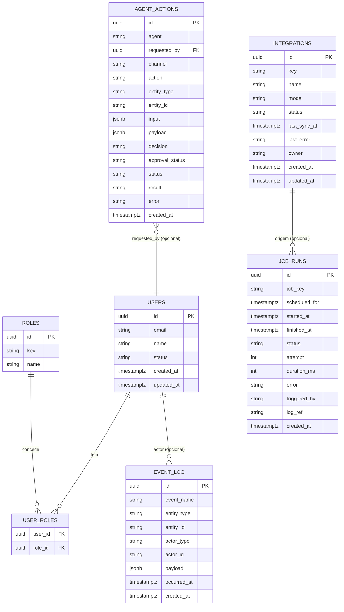

# ADR-0003 — PostgreSQL + Prisma e modelo de dados mínimo

- **Status:** Aceito
- **Data:** 2026-08-06
- **Decisores:** ARCHITECT (Bloco A), em alinhamento com ORCHESTRATOR
- **Bloco:** A — Fundação

## Contexto

O PRD (§14) e o diagnóstico (§7.3) fixam **PostgreSQL** como fonte de verdade
relacional. Falta escolher o ORM/toolkit de acesso (Prisma vs Drizzle) e validar
o **modelo de dados mínimo** que o Bloco A deve materializar: `users/roles`,
`agent_actions`, `event_log`, `integrations` e `job_runs`.

A hospedagem do Postgres (Supabase cloud vs self-hosted na VPS) é uma **decisão em
aberto** (PRD §19.6) e **não** deve ser resolvida agora. A escolha do ORM precisa
manter essa portabilidade.

## Decisão

### Banco: PostgreSQL

- No Bloco A, **Postgres local via Docker Compose** (mais Redis local, reservado
  para jobs futuros — sem uso real no Bloco A).
- Usar **Postgres "puro"** (sem depender de recursos exclusivos do Supabase como
  RLS ou GoTrue), preservando a opção Supabase-vs-self-hosted em aberto.
- Timestamps sempre `timestamptz` em UTC; renderização e regras de calendário em
  **America/Manaus** (PRD princípio 7). Nenhuma coluna de data "naive".

### ORM: Prisma

Adotar **Prisma** como ORM/migrator. Preferência do pedido, e defensável:
schema declarativo único, migrações versionadas, DX forte com TypeScript/Cursor,
tipos gerados que se alinham aos contratos de `packages/shared`.

Tensão reconhecida: se no futuro a escolha for **Supabase + RLS multi-tenant**,
o Drizzle tem ergonomia melhor para SQL/RLS. No Bloco A o sistema é interno e
single-tenant, com autorização na **camada de aplicação** (ADR-0004), então Prisma
não cria trava. Isso fica registrado como gatilho de revisão.

### Modelo de dados mínimo do Bloco A (5 áreas de fundação)

Apenas tabelas **transversais de fundação**. Entidades de domínio (Customer,
OpmCycle, EvSession, Settlement, etc.) **não** entram no Bloco A.

Notas de modelagem:
- **`integrations` não guarda credenciais.** Segredos ficam fora do banco e do
  repositório; a coluna referencia no máximo um *nome lógico* de credencial (ver
  ADR-0005). `mode ∈ {mock, read_only, bridge, write}`; `status ∈ {healthy,
  degraded, down, unknown}`.
- **`agent_actions` e `event_log` são append-only** na semântica (ver ADR-0007).
- **`job_runs`** registra execuções; o *catálogo* de jobs (nome, domínio, cron,
  criticidade, se envia mensagem externa) pode ser **seed/config estática** no
  Bloco A, já que Jobs é inventário mock (Tela 25).
- `users/roles/user_roles` é **stub de RBAC** (ADR-0004): papéis mapeiam as áreas
  do PRD (diretoria, financeiro, pluggamob, opm, tech, viewer). Sem tabela de
  `permission` granular no Bloco A.

### Migrações e seed

- Uma migração inicial cria as 5 áreas acima; seed popula papéis, usuários de dev,
  integrações mock (incl. WhatsApp — ADR-0006) e um catálogo de jobs de exemplo.
- Seed **nunca** contém segredos.

## Consequências

**Positivas**
- Modelo mínimo, auditável e suficiente para o shell + contratos de agente/integração.
- Prisma acelera migrações e tipagem; Postgres puro mantém hospedagem em aberto.

**Negativas / custos**
- Prisma tem ergonomia mais fraca para RLS/SQL avançado (relevante só se optarmos
  por Supabase+RLS no futuro).
- `jsonb` em `input/payload` exige disciplina de schema nos contratos (validação
  Zod em `packages/shared`).

**Neutras**
- Redis sobe no Compose mas fica ocioso no Bloco A (preparação para jobs reais).

## Alternativas consideradas

| Alternativa | Por que não agora |
|---|---|
| Drizzle | Ótimo para SQL/RLS, mas sem objeção fundamentada ao Prisma e com DX de migração menos madura para o time. |
| TypeORM | Histórico de inconsistências de migração; menos previsível. |
| Modelar entidades de domínio já no Bloco A | Fora de escopo; acopla a fundação a regras ainda não fechadas por domínio. |

## Gatilhos de revisão

- Decisão de hospedagem cair em **Supabase com RLS multi-tenant** → reavaliar
  Prisma vs Drizzle.
- Necessidade de SQL analítico pesado → considerar query builder dedicado ao lado
  do Prisma.

## Guardas de escopo

- Não modela domínios de negócio; só as 5 tabelas de fundação.
- Nenhum dado real de produção é importado; apenas seed local sem segredos.
