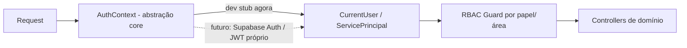

# ADR-0004 — Auth/RBAC do Bloco A como stub e evolução futura

- **Status:** Aceito
- **Data:** 2026-08-06
- **Decisores:** ARCHITECT (Bloco A), em alinhamento com ORCHESTRATOR
- **Bloco:** A — Fundação

## Contexto

O produto precisa de autenticação e de RBAC por área (PRD §14: "Supabase Auth +
RBAC por área"; §4 lista papéis: Dilkson, operação PluggaMob, financeiro, OPM,
compras, comercial, DK/Tech, e OpenClaw como consumidor de API). Porém o
**provedor de identidade** (Supabase Auth vs RBAC próprio) é uma **decisão em
aberto** (PRD §19.6, diagnóstico §12.3) e depende de escolhas — hospedagem, custo,
LGPD — que não devem travar a fundação.

O Bloco A entrega um shell navegável e uma API auditável **sem** cutover. Não há
usuários reais nem dados sensíveis de produção. Portanto, autenticação real de
provedor externo é prematura; um **stub bem abstraído** é o certo.

## Decisão

### AuthN — stub abstraído

- No Bloco A, a autenticação é um **stub de desenvolvimento**: usuários semeados
  (seed) e um mecanismo simples (ex.: header/JWT de dev assinado localmente) que
  produz um `CurrentUser` no request.
- Toda a leitura de identidade passa por uma **abstração** (`AuthContext` /
  provider de identidade) no módulo `core`. Nenhum controller lê token cru.
- Essa abstração permite **trocar o provedor depois** (Supabase Auth, Auth0, JWT
  próprio) sem tocar os domínios. A decisão de provedor fica adiada.

### RBAC — por papel/área, granularidade grossa

- Modelo `users` / `roles` / `user_roles` (ADR-0003). **Sem** tabela de
  `permission` fina no Bloco A.
- Autorização na **camada de aplicação** (NestJS Guards), por papel e por área,
  não em RLS de banco (mantém Postgres/ORM portáveis — ADR-0003).
- Papéis iniciais mapeando as áreas do PRD:

| Papel (key) | Área / uso |
|---|---|
| `admin` | Administração (usuários, áreas, permissões) |
| `diretoria` | Dilkson/gestores: dashboards e aprovações |
| `pluggamob` | Operação/Financeiro PluggaMob |
| `financeiro` | Financeiro Waze/Plugga |
| `opm` | OPM / auditoria energética |
| `tech` | DK/Tech: jobs, integrações |
| `viewer` | Leitura geral |

- **OpenClaw / agentes não têm "login de humano"** (mapa de produto §4): consomem
  a API por credencial de serviço e aparecem em `agent_actions` (ADR-0007). No
  Bloco A isso é um **principal de serviço stub**, também atrás da abstração de
  auth.

### O que fica protegido, mesmo no stub

- Endpoints mutáveis (ex.: `POST /agent-actions`) exigem principal autenticado e
  papel adequado — ainda que só localmente.
- Nenhuma credencial real, nenhum segredo no repositório (só `.env.example`).

## Consequências

**Positivas**
- Fundação segura e navegável sem comprometer a escolha de provedor.
- Troca de provedor no futuro é isolada ao módulo `core`.

**Negativas / custos**
- RBAC grosso pode exigir refino (permissões finas) quando domínios sensíveis
  (financeiro, aprovações) entrarem — previsto, não bloqueante.
- Stub de auth não deve, em hipótese alguma, ir para um ambiente exposto.

**Neutras**
- A modelagem de `users/roles` já serve o provedor futuro.

## Alternativas consideradas

| Alternativa | Por que não agora |
|---|---|
| Integrar Supabase Auth já no Bloco A | Antecipa decisão em aberto (hospedagem/LGPD) e adiciona dependência externa à fundação. |
| RLS de banco para autorização | Amarra a hospedagem e enfraquece portabilidade do ORM (ADR-0003). |
| Permissões finas desde já | Overengineering para um bloco sem domínios transacionais. |

## Gatilhos de revisão

- Entrada do primeiro domínio **write** (CRM PluggaMob) → fechar provedor de
  identidade e refinar RBAC/permissões por ação.
- Requisito de multi-empresa/tenant → reavaliar autorização (app-layer vs RLS).

## Guardas de escopo

- O stub é apenas local; não autoriza acesso a nenhum sistema real.
- Nenhuma decisão de provedor de identidade é tomada aqui — apenas a abstração
  que a mantém aberta.

---

## Adendo — 14/08/2026: papel `compras` e escopo por empresa

O gatilho de revisão previsto acima ("domínios sensíveis — financeiro,
aprovações") disparou com a entrada do módulo de Compras (POP-COMP-001). Duas
mudanças, ambas aditivas:

### 1. Papel `compras`

O PRD §4 sempre listou **Compras** como área própria, mas a tabela de papéis
iniciais desta ADR a omitiu, e ela nunca chegou a `roleKeys`. O POP-COMP-001 §1
separa **Responsável de Compras** de **Gestão Financeira**, e sem dois papéis a
segregação de função não existe: quem seleciona a cotação aprova a própria
escolha.

`compras` entra como papel **de empresa** (não de plataforma), ao lado de
`financeiro`. `admin` continua fora do fluxo operacional de compras de
propósito — administra acesso, não compra; deixá-lo aprovar esvaziaria o
controle justamente para quem tem a chave mestra.

### 2. Escopo por empresa vive no módulo, provisoriamente

Compras é a **primeira entidade de domínio com `companyId`**, e a premissa que
sustentava o RBAC achatado deixou de valer. `flattenRoles` documenta a
limitação: "um papel concedido em qualquer empresa passa a valer no guard — a
granularidade por empresa nas rotas de domínio ainda não existe (as entidades de
domínio não têm `companyId`)".

Agora têm. A prova de alcance `(pessoa, empresa, departamento financeiro)` foi
implementada em `apps/api/src/compras/compras-escopo.repository.ts`, dentro do
módulo, e **não** em `core/auth`. É dívida consciente: fundação morando em
domínio.

**Condição de promoção:** o segundo módulo de domínio a ganhar `companyId` deve
mover o mecanismo para `core/auth` — `AuthPrincipal` carregando as memberships e
um guard de empresa/departamento reutilizável — com Compras passando a
consumi-lo. Duplicar a classe num terceiro módulo, não. A promoção é mudança de
fronteira de plataforma e exige revisão do ARCHITECT.
