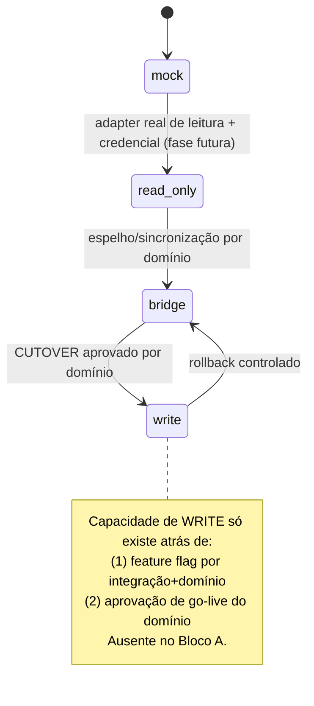

# ADR-0005 — Integrações read-only/mock → write por gate/cutover

- **Status:** Aceito
- **Data:** 2026-08-06
- **Decisores:** ARCHITECT (Bloco A), em alinhamento com ORCHESTRATOR
- **Bloco:** A — Fundação

## Contexto

A regra crítica do PRD e do diagnóstico é inequívoca: **nenhuma alteração na
operação atual** (Bitrix, OMIE, PluggaMob/OCPP, PagBank, WhatsApp, Telegram,
crons) sem cutover explícito por domínio (PRD "Regra crítica", §11, §16.1). O
produto começa como **espelho read-only** e só evolui para escrita por domínio,
após operação em paralelo e aprovação (PRD §5.4, §6.2, §15).

A Tela 26 exige que cada integração mostre seu **modo** (`read-only` / `bridge` /
`write`), última sync, erro e dono, sem expor segredos. Precisamos de uma
arquitetura que torne o modo um estado de primeira classe e impeça, por
construção, escrita acidental em produção.

## Decisão

### Ports & Adapters, com modo explícito

- Cada integração é acessada por uma **port** (interface) definida pelo domínio/
  módulo `integrations`. Implementações concretas são **adapters**.
- Cada integração tem um **modo** persistido em `integrations.mode ∈ {mock,
  read_only, bridge, write}` (ADR-0003).
- No **Bloco A, o adapter default é `mock`** para todas as integrações. Nenhum
  adapter real (que faça rede a sistemas de produção) é registrado.

### Máquina de estados do modo (governada por gate)

- Cada transição para a direita é um **gate**: exige decisão explícita e, a partir
  de `write`, aprovação de cutover do domínio afetado.
- A capacidade de **write não existe no código do Bloco A**: não há adapter de
  escrita registrado, e qualquer chamada mutável a sistema externo é barrada por
  um guard de modo (`assertMode`) além da feature flag.

### Segredos e credenciais

- **Nenhuma credencial no repositório nem no banco.** `integrations` referencia no
  máximo um *nome lógico* de credencial; o valor vem de ambiente/secret manager
  apenas nas fases futuras (fora do Bloco A).
- A UI (Tela 26) nunca renderiza token/senha/webhook completo (PRD §16.3, modelo
  de telas §Tela 26 "Regra de segurança").

### Superfície do Bloco A

- `integrations` semeadas como registros mock: Bitrix, OMIE, PluggaMob/OCPP,
  PagBank, WhatsApp (P0 — ADR-0006), Telegram, RapidAPI.
- Card mostra modo, status, última sync (simulada), erro (simulado), dono.
- Ações reais (testar conexão, rotacionar credencial, desabilitar) aparecem como
  **desabilitadas/placeholder** — sem efeito em sistemas reais.

## Consequências

**Positivas**
- Impossível escrever em produção por acidente: sem adapter real + guard de modo +
  flag ausente.
- Modo como dado de primeira classe alimenta a Tela 26 e o cutover por domínio.
- Ports desacoplam domínios dos SDKs externos (alinha ADR-0002).

**Negativas / custos**
- Manter mocks fiéis o bastante para o shell parecer real dá algum trabalho.
- Cada nova integração real exigirá ADR/decisão de fase (leitura → bridge → write).

**Neutras**
- PagBank é "import de arquivo", não API de escrita — mesmo assim entra como
  integração com modo, para consistência de UI/auditoria.

## Alternativas consideradas

| Alternativa | Por que não |
|---|---|
| Adapters reais read-only já no Bloco A | Exige credenciais e acesso a sistemas reais; contra a restrição do bloco. |
| Modo só como flag de UI (sem guard) | Não impede escrita acidental; auditoria fraca. |
| Um cliente por SDK importado no domínio | Acopla domínio ao fornecedor; dificulta mock e cutover. |

## Gatilhos de revisão

- Início da Fase 1 (espelho read-only real) → ADR por integração definindo adapter
  de leitura e manejo de credencial.
- Primeiro cutover para `write` → decisão de go-live por domínio (não é decisão de
  fundação).

## Guardas de escopo

- Nada aqui autoriza leitura ou escrita em sistemas reais: tudo é mock no Bloco A.
- Nenhum segredo é introduzido; credenciais só por referência lógica em fases
  futuras.
