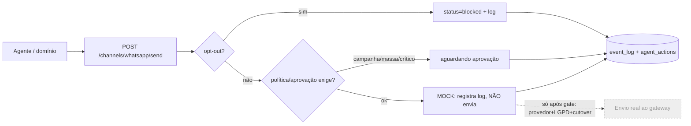

# ADR-0006 — WhatsApp P0 como integração formal sem envio real

- **Status:** Aceito
- **Data:** 2026-08-06
- **Decisores:** ARCHITECT (Bloco A), em alinhamento com ORCHESTRATOR
- **Bloco:** A — Fundação

## Contexto

O cliente validou que **WhatsApp não pode ficar implícito**: é integração de
primeira classe (P0), no mesmo nível de Bitrix/OMIE/PluggaMob, com saúde, fila,
log de entrega, opt-out, aprovação e LGPD (PRD §11, §11.1; telas 6, 11, 26, 27).
É o canal operacional principal (CRM, alertas, financeiro).

Ao mesmo tempo, a restrição do bloco proíbe **qualquer envio real** por WhatsApp/
Telegram, e o **provedor/gateway** (Plugguinha atual vs oficial Meta) e a
**política LGPD/opt-out/retenção** estão em aberto (PRD §19.8). Logo: formalizar a
integração e o contrato, **sem** disparar mensagem.

Este ADR é um caso específico do ADR-0005; existe separado porque WhatsApp tem
requisitos de contrato, opt-out e LGPD que merecem registro próprio.

## Decisão

### WhatsApp entra como integração formal — em modo `mock`

- Registro em `integrations` (key `whatsapp`) com `mode = mock` e card obrigatório
  na Tela 26, exibindo saúde da conexão, identidades/números (ex.: operação,
  Plugguinha) e último status — tudo simulado.

### Contrato de envio definido, execução mock (sem envio real)

- Contrato `POST /channels/whatsapp/send` definido em `packages/shared` (template/
  texto, destino, domínio de origem — CRM/Ops/Financeiro).
- No Bloco A o handler é **mock/no-op**: valida o payload, respeita opt-out,
  registra em `event_log` + `agent_actions` (se originado por agente) e retorna um
  resultado simulado (`queued`/`blocked`). **Não** há adapter que fale com gateway
  real; nenhuma mensagem sai.

### Requisitos de produto já honrados no contrato (mesmo em mock)

| Capacidade | Como no Bloco A |
|---|---|
| Opt-out permanente | Verificado antes de qualquer "send"; bloqueia e loga. |
| Aprovação humana | Campanha/massa e envios críticos entram como `aguardando aprovação`, nunca auto-enviados. |
| Log de entrega | `message_id` simulado, destino **mascarado**, status, domínio, usuário/agente. |
| Auditoria | Todo disparo por agente gera `agent_action` + evento (ADR-0007). |
| LGPD | Telefone mascarado na UI; base legal/retenção **em aberto** (não resolvido aqui). |

### Modelagem

- No Bloco A **não** materializamos `whatsapp_account` / `whatsapp_message_log` /
  `whatsapp_opt_out` como tabelas próprias — elas pertencem a um **domínio de
  canais** futuro. O registro fica em `integrations` + logs de auditoria
  (`event_log`/`agent_actions`) e o **contrato** vive em `packages/shared`.
  Materializar essas tabelas agora seria acoplar a fundação a um domínio ainda não
  fechado (sinalizado como over-reach — ver handoff).

## Consequências

**Positivas**
- WhatsApp é tratado como produto (não "atalho de notificação"), com contrato,
  opt-out e auditoria desde o dia 1.
- Zero risco de envio acidental: sem adapter real, com guard de modo + opt-out +
  aprovação.

**Negativas / custos**
- O contrato pode precisar de ajuste quando o provedor real (Meta vs Plugguinha)
  for escolhido.
- Sem tabelas dedicadas, o log de canal no Bloco A é mais raso (via auditoria) —
  aceitável para mock.

**Neutras**
- Telegram segue o mesmo princípio (canal, mock), mas sem o peso de P0.

## Alternativas consideradas

| Alternativa | Por que não |
|---|---|
| Integrar gateway real (mesmo só sandbox) | Proibido pela restrição; provedor em aberto; risco LGPD. |
| Tratar WhatsApp como simples notificação | Contraria PRD §11.1 (integração de primeira classe). |
| Criar tabelas de canal completas agora | Acopla fundação a domínio de canais não fechado. |

## Gatilhos de revisão

- Escolha do provedor/gateway e fechamento da política LGPD/opt-out/retenção
  (PRD §19.8) → ADR de canais + adapter real (read-only/bridge) sob gate (ADR-0005).
- Materialização do domínio de canais → criar `whatsapp_*` como entidades próprias.

## Guardas de escopo

- Nenhuma mensagem real é enviada por WhatsApp ou Telegram no Bloco A.
- Nenhum segredo/credencial de gateway entra no repositório.
