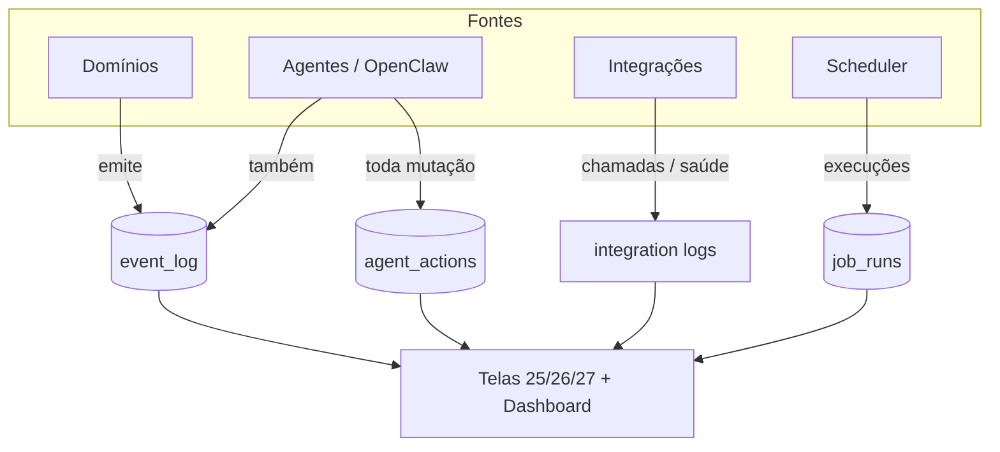

# ADR-0007 — Observabilidade: auditoria, event log e jobs

- **Status:** Aceito
- **Data:** 2026-08-06
- **Decisores:** ARCHITECT (Bloco A), em alinhamento com ORCHESTRATOR
- **Bloco:** A — Fundação

## Contexto

O PRD exige trilha de auditoria **obrigatória desde o dia 1**: `event_log`,
`agent_actions`, `integration_logs` e `job_runs` (§14, §16.2). Toda mutação de
agente gera `agent_action` (princípio 5); toda entidade crítica emite `EventLog`
(§10). Jobs devem ser observáveis, idempotentes e começar **read-only** — controle
real (pausar/reprocessar) só pós-cutover por domínio (§8 Tela 25, §15, modelo de
telas §12.5).

Este ADR separa a **semântica e a política** de observabilidade do modelo físico
(ADR-0003), porque essas regras são load-bearing e transversais a todos os
domínios.

## Decisão

### Quatro trilhas de observabilidade

1. **`event_log`** — append-only. Registra fatos de negócio (`user.reactivated`,
   `settlement.ready_for_review`, `invoice.received`, etc.). Campos: evento, tipo/id
   da entidade, `actor_type ∈ {user, agent, system}`, actor, payload (jsonb),
   `occurred_at`. Nomes de evento são constantes em `packages/shared`.
2. **`agent_actions`** — toda ação mutável de agente registra: agente, solicitante,
   canal, ação, input, payload, decisão, aprovação, resultado, erro, timestamp
   (PRD §12). Regra: **o OpenClaw não grava estado crítico sem `agent_action`**.
   No Bloco A o campo *solicitante* (`requested_by`) é **sempre nulo** — ver
   "Atribuição humana" adiante.
3. **Integration logs** — chamadas externas e saúde por integração (Tela 26). No
   Bloco A, como não há chamada real, os registros de saúde são simulados; o
   detalhe físico pode reusar `event_log` (com `entity_type = integration`) para
   manter o modelo mínimo, evoluindo para tabela dedicada quando adapters reais
   surgirem (ADR-0005). **Nunca** loga segredo/credencial.
4. **`job_runs`** — execuções do scheduler: status (`queued/running/success/
   failed/skipped`), tentativa, duração, erro, gatilho, referência de log.

### Semântica e regras

- **Append-only:** `event_log` e `agent_actions` não são editados/apagados na
  operação normal; correções entram como novos registros.
- **Timezone:** timestamps `timestamptz` em UTC; toda regra/apresentação de
  calendário em **America/Manaus** (PRD princípio 7). Janela semanal de fechamento
  e prazos de job seguem Manaus.
- **Idempotência de jobs:** todo job é projetado idempotente (chave de execução),
  com retry — princípio para substituir "crons ruins" por jobs idempotentes
  (diagnóstico §6, §5.3).
- **Jobs read-only no Bloco A:** a Tela 25 é **inventário**. Não há pausar,
  reprocessar ou migrar cron real; o scheduler do Bloco A apenas popula `job_runs`
  com dados mock/inventário. Controle real vem por cutover de domínio.
- **Segurança:** nenhum log expõe token/senha/webhook (PRD §16.3).

### Atribuição humana (`requested_by`) — nula por design no Bloco A

`POST /agent-actions` aceita **somente service principal** e rejeita principal
humano ou identidade divergente do principal autenticado (correção de review do
Gate B). Isso fecha a falsificação de autoria de agente, mas elimina o caminho
pelo qual um humano solicitante seria gravado na linha.

Decisão do ORCHESTRATOR, 2026-08-06:

- **`agent_actions.requested_by` é sempre `NULL` no Bloco A.** Nenhum código de
  aplicação o popula; os services gravam `null` explicitamente.
- **A coluna, a FK para `users` e o índice `agent_actions_requested_by_idx`
  permanecem no migration inicial**, pré-provisionados e **intencionalmente
  inertes**. Isto **não é bug**: não "corrija" populando o campo e não remova a
  coluna sem um novo ADR. A pré-provisão é deliberada — a cadeia humano→agente é
  requisito de produto conhecido (PRD §12) e o índice não custa nada num schema
  ainda vazio.
- **A autoria humana existe apenas em `event_log.payload.requestedByPrincipal`**,
  como **string livre**: não é FK, não é joinável e não é consultável por índice.
- **Consequência de produto:** a tela de auditoria do Bloco A **não exibe
  "solicitado por" joinável** em `agent_actions`. Qualquer exibição de solicitante
  é texto do payload do evento, sem integridade referencial nem garantia de
  corresponder a um usuário existente.

Ativar o campo é decisão futura e exige contrato explícito (ex.: `requestedByUserId`
validado contra `users`), regra de autorização sobre quem pode declarar solicitante
e revisão de segurança — um solicitante autodeclarado reabriria exatamente o vetor
de falsificação que a restrição atual fechou.

### Superfície do Bloco A

- API grava `agent_actions` (`POST /agent-actions`) e `event_log` localmente.
- Catálogo de jobs como seed/config estática; `job_runs` semeadas para o inventário
  da Tela 25.
- Dashboard/Telas 25–27 leem essas trilhas (mock/local).

## Consequências

**Positivas**
- Auditoria e observabilidade nascem com a fundação; agentes e integrações já têm
  contrato de trilha.
- Modelo mínimo evita tabela dedicada de integration log prematura, mantendo o
  Bloco A enxuto.

**Negativas / custos**
- `event_log`/`agent_actions` crescem rápido em produção → **retenção é decisão em
  aberto** (PRD §19.10); não resolvida aqui, apenas sinalizada.
- Reusar `event_log` para saúde de integração é simplificação a revisitar quando
  adapters reais existirem.
- `requested_by` inerte deixa a cadeia humano→agente sem representação consultável
  no Bloco A: a tela de auditoria não tem como filtrar, agrupar ou joinar por
  solicitante. FEATURE e UI_QA devem desenhar a tela contando com essa ausência.

**Neutras**
- BullMQ/Redis previstos (PRD §14) sobem no Compose mas ficam ociosos no Bloco A.

## Alternativas consideradas

| Alternativa | Por que não agora |
|---|---|
| Tabela dedicada de `integration_logs` já no Bloco A | Sem chamadas reais, agrega pouco; reuso de `event_log` mantém mínimo. |
| Scheduler real (BullMQ ativo) controlando jobs | Viola "jobs read-only até cutover"; risco operacional. |
| Log em arquivo/stdout apenas | Não atende auditoria consultável por tela (25/27). |

## Gatilhos de revisão

- Volume/retenção de `agent_actions`/`event_log` → definir política de retenção e,
  se preciso, particionamento (PRD §19.10).
- Entrada de adapters reais de integração → promover integration logs a tabela
  dedicada.
- Primeiro domínio com jobs reais → ativar BullMQ/Redis e controle pós-cutover.
- Primeira tela ou relatório que exija "solicitado por" consultável → ativar
  `requested_by` via contrato explícito, autorização e revisão de segurança.

## Guardas de escopo

- Nenhum cron/job de produção é criado, pausado, reprocessado ou migrado.
- Nenhum segredo é logado; nada aqui toca sistemas reais.
