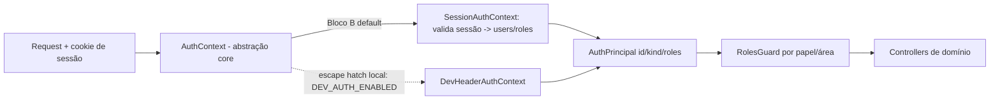

# ADR-0008 — Auth self-hosted single-tenant (Bloco B)

- **Status:** Aceito
- **Data:** 2026-08-06
- **Decisores:** ARCHITECT (Bloco B), em alinhamento com ORCHESTRATOR
- **Bloco:** B — Auth real + Migradores read_only
- **Supera parcialmente:** ADR-0004 (tira o auth do estado *stub*; mantém o seam `AuthContext`)

## Contexto

O Bloco A entregou autenticação como **stub** atrás da abstração `AuthContext`
(ADR-0004): um `DevHeaderAuthContext` que lê `x-dev-principal`/`x-dev-roles`,
gated por `DEV_AUTH_ENABLED` (default `false`, proibido em produção pelo
`environment.ts`). O modelo `users`/`roles`/`user_roles`, o `RolesGuard` por papel
e os papéis `admin/diretoria/pluggamob/financeiro/opm/tech/viewer` já existem.

O Bloco B precisa de **autenticação real** para o OS ser utilizável localmente e
depois em staging/VPS **do cliente**. A natureza do produto é **load-bearing**:

> **plugga-os não é SaaS multi-tenant.** É sistema operacional interno,
> single-tenant, hospedado na infra do cliente. Identidade e dados vivem no
> **Postgres do projeto**.

Disso decorre uma proibição dura: **Supabase Auth / Clerk / Auth0 / qualquer SaaS
de identidade estão vetados como default.** A escolha é entre duas formas de
self-host: uma biblioteca de auth (Better Auth) ou auth nativo do stack
(Nest + Passport/sessão + Prisma sobre `users`/`roles`).

## Decisão

### Recomendação: **Nest + Passport (local) + sessão server-side em Postgres + Prisma**, sobre os `users`/`roles` existentes

Auth nativo do stack, atrás do seam `AuthContext` já existente. **Better Auth é
rejeitado como default** (ver Alternativas). A razão curta: a fundação já
comprometeu Prisma + `users`/`roles`/`user_roles` + `RolesGuard` + `AuthContext`,
e Better Auth traria um **segundo esquema de identidade** e um modelo de
integração por HTTP-handler que briga com a DI do NestJS e com o RBAC/auditoria já
contratados. O caminho nativo mantém a superfície de segurança pequena, revisável
e nativa, encaixando atrás do `AuthContext` com **zero churn nos domínios** —
exatamente a evolução que o ADR-0004 previu.

### O seam `AuthContext` é preservado

- O provider default passa a ser um **`SessionAuthContext`** que resolve o cookie
  de sessão para um `AuthPrincipal` (`id`, `kind: user|service`, `roles`)
  consultando `users`/`roles` via Prisma. O contrato `AuthPrincipal` e o
  `RolesGuard` **não mudam**.
- `DevHeaderAuthContext` deixa de ser o caminho de produção e vira **escape hatch
  estritamente local**, atrás de `DEV_AUTH_ENABLED` (default `false`, já proibido
  em produção). Não é removido — é útil em testes/e2e — mas **nunca** é o provider
  default fora de dev.

### Fluxos B1 (login por e-mail+senha, sessão, logout, convite/reset)

| Fluxo | Decisão |
|---|---|
| **Hash de senha** | **Argon2id** (recomendação OWASP; parâmetros calibrados no server). bcrypt é fallback aceito, não preferido. Hash guardado em coluna nova de credencial ligada a `users`; nunca em log/evento. |
| **Sessão** | **Server-side, opaca, persistida em Postgres** (tabela `sessions`: id, `user_id` FK, hash do token, `expires_at`, `created_at`, metadados de device/IP). Cookie `httpOnly`, `Secure` (fora de local), `SameSite=Lax`, `Path=/`. |
| **Refresh / expiração** | Sessão com validade curta + **rotação** no uso (sliding) e expiração absoluta. Sem JWT stateless de acesso longo (ver Alternativas). Se JWT for adotado depois, o *refresh token* é uma sessão server-side revogável — o seam não muda. |
| **Logout** | Revoga a sessão no banco (delete/expire) e limpa o cookie. Revogação é **imediata** por ser server-side (motivo central da escolha sobre JWT). |
| **Convite** | Admin cria `users` sem senha + token de convite de uso único, expira em janela curta, entregue via `EmailPort` (ADR-0010). O convidado define a senha ao aceitar. |
| **Reset de senha** | Token de uso único, expira em janela curta, entregue por e-mail; invalida sessões ativas do usuário ao concluir. Não revela se o e-mail existe. |
| **Rate limit** | `@nestjs/throttler` nas rotas de auth (login, reset, convite, aceite). Limite por IP + por identidade; resposta genérica; lockout progressivo em tentativas de login. |
| **Cookies** | `httpOnly` sempre; `Secure` sempre que não-local; `SameSite=Lax`; sem token de sessão acessível a JS. CSRF: SameSite + verificação de origem nas rotas mutáveis. |

### RBAC (papéis existentes, camada de aplicação)

- Autorização segue no `RolesGuard` por papel, na camada de aplicação (não RLS —
  mantém ADR-0003/0004). Papéis: `admin`, `diretoria`, `pluggamob`, `financeiro`,
  `opm`, `tech`, `viewer`. Nenhum papel novo é introduzido no B1.
- `admin` administra usuários/papéis (convite, reset, atribuição de papel,
  desativação). Desativar usuário revoga sessões.
- **Agentes/OpenClaw continuam service principal** (`kind: "service"`,
  `id` com prefixo `service:`), **sem login de humano**, auditados em
  `agent_actions` (ADR-0007). Auth de serviço é por credencial de serviço em
  `.env`/secret local, não por sessão de cookie.

### Configuração e segurança (`DEV_AUTH_*` e afins)

- `DEV_AUTH_ENABLED` permanece **`false` por default** e **proibido em produção**
  (invariante do `environment.ts` do Bloco A, preservado). O `.env.example` pode
  mantê-lo `true` para dev local; nenhum ambiente não-dev o habilita.
- Segredos de auth (chave de assinatura de cookie/sessão, credencial de serviço)
  vivem só em `.env`/secret local — **nunca** no git. Adicionados ao schema de
  ambiente com validação, no mesmo padrão do Bloco A.
- **Nenhum SaaS de identidade** é introduzido. Nenhuma chamada de auth sai do
  perímetro do cliente (exceto e-mail transacional via `EmailPort`, ADR-0010).

## Consequências

**Positivas**
- Encaixa no stack e no seam existentes: `AuthContext`/`AuthPrincipal`/`RolesGuard`
  e `users`/`roles` são reusados sem churn nos domínios.
- Superfície de segurança pequena, própria e **revisável** — sem esquema de
  identidade paralelo nem dependência opinativa dona da identidade.
- Sessão em Postgres = revogação imediata (logout, desativação, troca de papel),
  SoT único, alinhado à auditoria append-only.
- Single-tenant não paga por breadth multi-tenant/social que não usa.

**Negativas / custos**
- Mais código próprio a escrever e manter (reset/convite/rate-limit/lockout) — a
  partir de primitivas conhecidas, e sob review do ARCHITECT. É custo aceito em
  troca de controle sobre a superfície de segurança.
- Detalhes de segurança (rotação, CSRF, lockout) precisam ser feitos corretamente
  por nós; mitigado por revisão e testes e2e de login (aceite B1).

**Neutras**
- Redis (ADR-0007/BullMQ) está disponível, mas a sessão fica em Postgres para
  manter SoT único e não acoplar disponibilidade de auth ao Redis. Redis como
  store de sessão é otimização futura, não decisão de fundação.

## Alternativas consideradas

| Alternativa | Otimiza para | Por que **não** como default |
|---|---|---|
| **Better Auth** (Prisma adapter) | Baterias inclusas (reset/verify/2FA/rate-limit), menos código | Dono do **próprio esquema** (`user`/`session`/`account`) → **segunda identidade** conflitando com `users`/`roles`; modelo de mount por HTTP-handler briga com DI do Nest; plugin de RBAC não mapeia `roles`/`user_roles`/`RolesGuard`; adiciona dependência grande dona de superfície load-bearing. Custo de integração > economia de código num tool single-tenant. **Reconsiderar** só se o volume de features de auth (2FA, magic link, org) crescer a ponto de o build próprio virar passivo. |
| **JWT stateless + refresh** | Menos leitura de sessão no banco | Revogação cara: logout/desativação/troca de papel não são imediatos sem denylist — que reintroduz estado server-side. Num tool interno, revogação imediata vale mais que economizar um SELECT. Fica documentado como evolução se surgir gargalo de leitura de sessão. |
| **Supabase Auth / Clerk / Auth0** | Setup rápido | **Proibido**: SaaS de identidade fora do perímetro do cliente; contraria "não é SaaS / self-hosted". |
| **RLS de banco para authz** | Authz no banco | Amarra hospedagem e enfraquece portabilidade do ORM (ADR-0003/0004). Authz segue app-layer. |
| **Passport puro sem sessão server-side** | Simplicidade de libs | Passport entra só como *local strategy* de login; a sessão revogável em Postgres é o que sustenta logout/desativação. Passport é detalhe de implementação, não a decisão. |

## Gatilhos de revisão

- Requisito de 2FA / magic link / SSO corporativo → reavaliar build próprio vs
  Better Auth/OIDC self-hosted (ex.: Keycloak/Zitadel na VPS do cliente), sempre
  atrás do mesmo `AuthContext`.
- Necessidade de permissões finas (por ação, não por papel) → refinar RBAC
  (gatilho já herdado do ADR-0004).
- Gargalo de leitura de sessão → mover store de sessão para Redis (o seam não
  muda) ou adotar JWT+refresh com denylist.
- Multi-empresa/tenant (mudaria a natureza do produto) → reabrir esta decisão por
  completo.

## Guardas de escopo

- Nenhum SaaS de identidade é introduzido; nenhuma identidade sai do perímetro do
  cliente.
- Nenhum segredo de auth entra no repositório (só `.env`/secret local).
- `DEV_AUTH_ENABLED` nunca é o caminho de auth fora de dev; segue `false` por
  default e proibido em produção.
- Este ADR não autoriza write/cutover em nenhum sistema externo — apenas
  autenticação local do próprio OS.

---

# Adendo 1 — Identidade federada com o Google (2026-08-10)

- **Status:** Aceito
- **Gatilho:** "SSO corporativo", previsto nos *Gatilhos de revisão* acima
- **Não supera:** nada. O corpo do ADR-0008 continua valendo inteiro.

## O que muda

O login por e-mail e senha ganha um **segundo meio de provar identidade**: uma
conta Google, verificada por OpenID Connect via Google Identity Services.

O que **não** muda — e é onde este adendo se distingue do que a decisão original
proíbe:

| Continua sendo do Postgres do cliente | Passa a poder vir do Google |
|---|---|
| Quem existe (`users`) | A prova de que a pessoa é ela mesma |
| Se pode entrar (`users.status`) | — |
| O que alcança (papéis, empresas, departamentos) | — |
| A sessão (opaca, server-side, revogável) | — |
| A revogação (logout, desativação, expiração) | — |

A proibição do corpo do ADR — *"Supabase Auth / Clerk / Auth0 / qualquer SaaS de
identidade estão vetados"* — é sobre **quem é a fonte de verdade da identidade**.
Um provedor federado que só atesta "esta pessoa controla esta conta Google", e
cuja resposta é descartada assim que a sessão local é emitida, não move a fonte
de verdade para fora. Um provedor que passasse a ser dono da lista de usuários,
da autorização ou da sessão moveria — e esse continua vetado.

## Limites que fazem o adendo caber no ADR

1. **Sem autocadastro.** Conta no plugga-os nasce de convite. Um Google válido
   cujo e-mail não corresponda a um usuário local é recusado; nenhum usuário,
   empresa, departamento ou papel é criado a partir de claims do Google.
2. **A identidade permanente é o `sub`**, não o e-mail. O e-mail decide uma única
   vez: no primeiro vínculo. Depois disso ele pode mudar sem trocar a identidade,
   e mudar não reatribui conta nenhuma.
3. **Nenhum token do Google é persistido** — nem ID token, nem access, nem
   refresh. Não há client secret neste fluxo. Os escopos são só de identidade
   (`openid`, `email`, `profile`); nada de Gmail, Drive ou qualquer API Google.
4. **Nenhuma segunda sessão.** O login Google termina chamando o mesmo
   `SessionService.issue`, com o mesmo cookie `plugga_session`. Não entra
   Auth.js/NextAuth, Better Auth nem tabela de sessão paralela — o motivo é o
   mesmo pelo qual o Better Auth foi rejeitado no corpo do ADR.
5. **O e-mail e senha continua disponível.** O Google é opcional, e a queda do
   Google não pode ser uma queda do acesso ao sistema.
6. **`GOOGLE_AUTH_ENABLED` é o rollback**, e é `false` por default. Com a flag
   desligada a rota recusa e o botão some; nada da tabela de vínculos é apagado.
7. **Um `sub` por pessoa e uma pessoa por `sub`**, garantido por constraint
   única — não por checagem no serviço, que perde a corrida.

## Consequências

**Positivas**
- Elimina uma senha a mais para quem já vive dentro do Google Workspace, sem
  tirar do cliente o controle de quem entra.
- A ativação de convite pelo Google encurta a entrada de gente nova: não há
  senha para criar antes do primeiro acesso.
- A revogação continua sendo uma só, no mesmo lugar: desativar a pessoa fecha
  senha e Google juntos.

**Negativas / custos**
- Passa a existir uma dependência externa no caminho de login. Mitigada por
  falha fechada e temporária (`503`, não "conta não autorizada") e pelo login
  por senha continuar íntegro ao lado.
- Uma configuração administrada fora do repositório (OAuth Client no Google
  Cloud) precisa ficar sincronizada com o ambiente: audiência e URI de callback
  divergentes derrubam o login sem nenhum código ter mudado.
- Contas Google criadas sobre e-mail de terceiro trazem `email_verified=true`
  sem que o Google seja autoridade sobre aquela caixa postal. O primeiro vínculo
  as recusa; essas pessoas entram por senha.

## Gatilhos de revisão deste adendo

- Pedido de One Tap, seleção automática ou popup → reavaliar a experiência
  (COOP/FedCM entram no escopo).
- Pedido de troca/desvínculo de conta Google pela tela de Equipe → precisa de
  fluxo autenticado próprio; hoje é ato administrativo no banco.
- Pedido de autocadastro por domínio → reabre a decisão 1 acima e exige uma
  política de acesso inicial que hoje não existe.
- Necessidade de CSP → precisa liberar os endpoints oficiais do GIS junto com os
  demais terceiros já embutidos nas telas.
