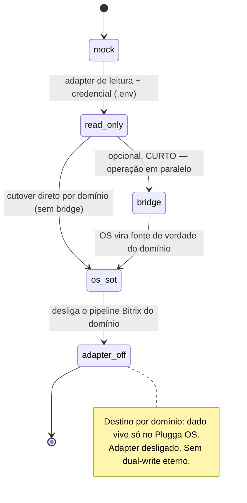

# ADR-0009 — Bitrix como Migrador temporário (não integração eterna)

- **Status:** Aceito
- **Data:** 2026-08-06
- **Decisores:** ARCHITECT (Bloco B), em alinhamento com ORCHESTRATOR
- **Bloco:** B — Auth real + Migradores read_only
- **Refina:** ADR-0005 (Ports & Adapters + `mode` de 1ª classe) para o caso Bitrix

## Contexto

Bitrix hoje concentra dados operacionais do cliente (OPM, Compras, Vendas, entre
outros). O erro de enquadramento a evitar é tratá-lo como **integração
permanente** — o que perpetuaria dependência, dual-write e um segundo SoT. A
decisão de produto é explícita:

> **Bitrix é um Migrador temporário, não uma integração eterna.** O destino é o
> dado viver **só no Plugga OS**. Sem dual-write eterno.

A fundação já sustenta isso: `integrations.mode ∈ {mock, read_only, bridge, write}`
existe no schema (ADR-0003), o registro `bitrix` está semeado em `mode = mock`, e o
ADR-0005 já governa transições de modo por gate. Este ADR **nomeia** a natureza
temporária e define a máquina de ciclo de vida **por domínio**, com data de morte.

## Decisão

### Nomenclatura

Os nomes canônicos são **`Bitrix Migrator`** (o componente) e **`migration
adapter`** (o adapter concreto). Na UI de Integrações, Bitrix aparece rotulado
como **"Migrador (temporário)"**, não como integração comum (ADR-0005 / epic B1).
"Integração Bitrix eterna" é vocabulário proibido.

### Máquina de ciclo de vida — **por domínio**, com data de morte

- Cada **domínio** (OPM, Compras, Vendas, ...) percorre a máquina **de forma
  independente** e tem uma **data de morte** do modo Bitrix: o ponto em que o
  adapter é desligado para aquele domínio.
- **`bridge` é opcional e curto** — janela de operação em paralelo para validar o
  espelho antes do cutover, não um estado de repouso. Um domínio pode ir de
  `read_only` direto a OS-SoT se não precisar de paralelo.
- `os_sot` = o Plugga OS é a fonte de verdade daquele domínio. `adapter_off` = o
  pipeline Bitrix daquele domínio é desligado. A partir daí não há leitura nem
  escrita Bitrix para o domínio.

### Escopo do Bloco B: **só até `read_only`**

- No Bloco B, o Bitrix Migrator opera **no máximo em `read_only`**: importa/espelha
  para dentro do Postgres do OS. `bridge`/`os_sot`/`adapter_off` são estados de
  fases posteriores, cada transição sob gate + aprovação humana (ADR-0005).
- **Zero write ao Bitrix, sempre.** O adapter é **read-only por construção**: não
  existe caminho de escrita ao Bitrix em nenhum estado. "Cutover" aqui significa o
  OS assumir o domínio e o Bitrix ser **desligado** — nunca o OS escrever no
  Bitrix.
- **Sem dual-write eterno:** `bridge` é transitório e termina em `adapter_off`. Não
  há estado estável em que OS e Bitrix são ambos escritos indefinidamente.

### Ordem de domínios prioritários

| Prioridade | Domínio | Código | Observação |
|---|---|---|---|
| 1 | OPM | **C7** | Primeiro alvo de espelho read_only |
| 2 | Compras | **C43** | |
| 3 | Vendas | **C0** | |

A ordem é de **início do espelho read_only**; o avanço de cada domínio na máquina é
decisão de fase por domínio, não deste ADR.

### Jobs de import

- O import roda como **job idempotente em BullMQ + Redis** (jobs novos usam BullMQ
  — ADR-0007 / epic B1), com chave de execução, retry e registro em `job_runs`.
- Toda execução alimenta `job_runs`; falhas e saúde do espelho ficam observáveis
  (ADR-0007). Import é read-only: lê do Bitrix, grava só no Postgres do OS.

### Credenciais e segurança

- Credencial do Bitrix vive **só em `.env`/secret local** — nunca no git, nunca na
  tabela `integrations` (que guarda no máximo um nome lógico de credencial —
  ADR-0005). Nenhum log/evento expõe token/endpoint real (ADR-0007).
- A capacidade de leitura real só existe quando o domínio sai de `mock` para
  `read_only`, com a credencial presente no ambiente — decisão de fase, sob gate.

## Consequências

**Positivas**
- Enquadra Bitrix como passivo a extinguir, não ativo a manter: cada domínio tem
  saída explícita (`adapter_off`).
- Reusa `integrations.mode`, `job_runs` e o gate do ADR-0005 — nenhuma máquina de
  estado nova precisa ser inventada.
- Read-only por construção elimina, por design, risco de alteração em produção
  Bitrix.

**Negativas / custos**
- Mapear o modelo Bitrix → modelo do OS por domínio dá trabalho e pode revelar
  divergências de dados; é trabalho de fase, não de fundação.
- A janela `bridge` exige disciplina para não virar dual-write de fato — mitigado
  por ela ser explicitamente curta e por cada domínio ter data de morte.

**Neutras**
- OMIE e PluggaMob seguem o mesmo padrão de migrador read_only quando entrarem
  (ordem no epic), mas cada um terá seu próprio enquadramento de fase.

## Alternativas consideradas

| Alternativa | Por que **não** |
|---|---|
| Bitrix como integração permanente (dual-write) | Perpetua segundo SoT e dependência; contraria a decisão de produto (dado vive só no OS). |
| Migração big-bang de todos os domínios de uma vez | Alto risco; impede validar espelho por domínio; sem janela de paralelo. |
| Escrever de volta no Bitrix durante o bridge | Proibido: zero write em produção; reabre risco de corromper a operação atual. |
| Guardar credencial Bitrix em `integrations` | Segredo no banco; contraria ADR-0005. |

## Gatilhos de revisão

- Domínio pronto para sair de `read_only` → decisão de fase (bridge curto? cutover
  direto?) + aprovação humana; define a data de morte do adapter para o domínio.
- Divergência estrutural Bitrix ↔ OS num domínio → ADR de mapeamento do domínio.
- Último domínio em `adapter_off` → aposentar o Bitrix Migrator por completo.

## Guardas de escopo

- **Zero write ao Bitrix** em qualquer estado; o adapter é read-only por
  construção.
- No Bloco B, Bitrix não passa de `read_only`; `bridge`/cutover exigem gate +
  aprovação futura.
- Nenhum segredo de Bitrix no repositório nem na tabela `integrations`.
- Nenhum cutover de domínio sem aprovação humana explícita (ADR-0005).
