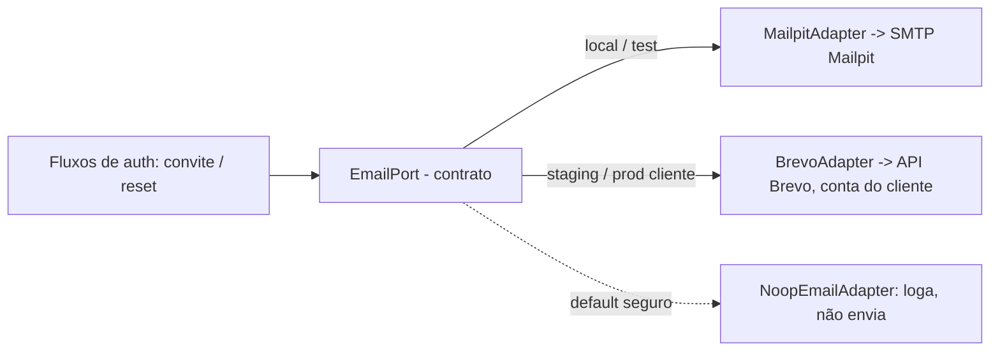

# ADR-0010 — E-mail transacional: Brevo atrás de `EmailPort`, Mailpit em local

- **Status:** Aceito
- **Data:** 2026-08-06
- **Decisores:** ARCHITECT (Bloco B), em alinhamento com ORCHESTRATOR
- **Bloco:** B — Auth real + Migradores read_only
- **Depende de:** ADR-0008 (convite/reset por e-mail), ADR-0005 (Ports & Adapters)

## Contexto

Os fluxos de auth do Bloco B (convite e reset de senha — ADR-0008) exigem **e-mail
transacional real**. A decisão de produto: o provedor é o **Brevo, na conta do
cliente** (não uma conta da Zynox). Em desenvolvimento local, nenhum e-mail deve
sair para a internet.

Isso é um caso do ADR-0005 (Ports & Adapters): o domínio fala com uma **port**, e o
provedor é um **adapter** trocável. E-mail é o **primeiro adapter externo real** do
produto — mas de saída transacional própria, não leitura/escrita de um sistema de
produção de terceiros; logo não é write de cutover no sentido do ADR-0005/0009.

## Decisão

### `EmailPort` como contrato; adapters por ambiente

- **`EmailPort`** é a interface consumida pelos fluxos de auth: `sendTransactional`
  com destinatário, template, variáveis e domínio de origem. Nenhum fluxo importa
  SDK de e-mail direto.
- **Local/test → `MailpitAdapter`**: envia por SMTP para **Mailpit** (container do
  Compose), que captura tudo numa inbox local. **Zero e-mail sai para a internet
  em dev.**
- **Staging / VPS do cliente → `BrevoAdapter`**: usa a **API/SMTP do Brevo na conta
  do cliente**. Credencial só em `.env`/secret local do ambiente — nunca no git.
- **Default seguro:** sem configuração de provedor, a port resolve para um
  `NoopEmailAdapter` que **loga e não envia** — nunca um envio acidental por falta
  de config.

### Seleção de adapter

- O adapter é escolhido por configuração de ambiente (ex.: `EMAIL_PROVIDER ∈
  {mailpit, brevo, noop}`), validada no schema de ambiente (padrão do Bloco A).
  Local usa `mailpit`; nenhum ambiente não-cliente aponta para Brevo real.

### Templates (convite / reset)

- Dois templates no Bloco B: **convite** e **reset de senha**, alinhados aos fluxos
  do ADR-0008. Conteúdo em português, com link de token de uso único e expiração
  curta.
- Os templates vivem no OS (versionados) e são renderizados server-side; variáveis
  (nome, link, validade) passam pela port. Não se depende do editor de templates do
  Brevo para não acoplar o fluxo ao provedor.
- **Segurança:** o link carrega token opaco de uso único; e-mail nunca inclui
  senha; nada de token/segredo em log (ADR-0007).

### Checklist SPF / DKIM (entregabilidade, ambiente do cliente)

Pré-requisito de produção **do lado do cliente**, documentado aqui como checklist
(não é código do Bloco B):

- [ ] **SPF**: incluir o Brevo no registro SPF do domínio remetente do cliente.
- [ ] **DKIM**: publicar a chave DKIM do Brevo no DNS do domínio do cliente.
- [ ] **DMARC**: registro `DMARC` presente (política ao menos `p=none` para
      monitorar; endurecer depois).
- [ ] **Remetente verificado**: domínio/remetente autenticado no painel Brevo do
      cliente.
- [ ] **Validação**: enviar e-mail de teste e confirmar `spf=pass` / `dkim=pass`
      no cabeçalho recebido.

Em local (Mailpit) o checklist não se aplica — nada sai para a internet.

## Consequências

**Positivas**
- Convite/reset reais em staging/prod sem acoplar o OS ao Brevo: trocar de provedor
  é trocar o adapter.
- Dev 100% offline para e-mail (Mailpit); zero risco de e-mail acidental a usuário
  real.
- Templates versionados no OS = revisáveis e portáveis entre provedores.

**Negativas / custos**
- Manter paridade entre render local (Mailpit) e entrega real (Brevo) exige um
  smoke em staging antes de confiar em entregabilidade.
- SPF/DKIM dependem de acesso ao DNS do cliente — fora do controle do time; por
  isso é checklist, não automação.

**Neutras**
- A mesma `EmailPort` serve notificações futuras (não-auth), mas o Bloco B só usa
  convite/reset.

## Alternativas consideradas

| Alternativa | Por que **não** |
|---|---|
| SMTP direto do provedor no código de auth | Acopla domínio ao provedor; sem troca por ambiente; difícil testar offline. |
| Conta de e-mail da Zynox | Contraria a decisão: e-mail sai da **conta do cliente**, no perímetro dele. |
| Enviar e-mail real em dev (mesmo sandbox) | Risco de vazar para usuário real; Mailpit dá inbox local sem esse risco. |
| Templates só no painel Brevo | Acopla o fluxo ao provedor e sai do versionamento/review do OS. |

## Gatilhos de revisão

- Troca de provedor de e-mail (ex.: SES/Resend) → novo adapter atrás da mesma port.
- Necessidade de e-mail não-transacional (marketing/campanha) → decisão à parte;
  esta port é só transacional.
- Problemas de entregabilidade em prod → revisitar SPF/DKIM/DMARC e warm-up.

## Guardas de escopo

- Nenhum e-mail sai para a internet em desenvolvimento (Mailpit apenas).
- Credencial Brevo só em `.env`/secret local do ambiente do cliente — nunca no git.
- Nenhum segredo/token em log ou template.
- Este ADR não introduz envio a canais de produção de terceiros (WhatsApp/Telegram
  seguem no-op — ADR-0006 / ADR-0011).

---

## Adendo — 10/08/2026: Mailpit removido

O `MailpitAdapter` e o container Mailpit (dev local e VPS) foram removidos.
Brevo é o único provedor real desde 09/08/2026, e o container na VPS não tinha
mais consumidor — `EMAIL_PROVIDER=brevo` já sobrescrevia o default do compose.

O motivo imediato: nesta máquina o backend de desenvolvimento passou a ser
sempre a VPS via túnel SSH (sem Docker local), e rodar teste local contra o
`.env` gravou eventos de verdade — embora inofensivos — na trilha append-only
de produção e no Mailpit da VPS. Removê-lo fecha essa classe de acidente pela
raiz, e não só neste caso.

`EMAIL_PROVIDER` aceita hoje **`noop` | `brevo`**. O default local passou a
ser `noop`: sem provedor configurado, a API simplesmente não envia — nunca
tenta um host que não existe mais.

**Custo aceito:** os testes e2e do caminho feliz de convite/redefinição de
senha via UI (que liam o token no Mailpit) foram removidos junto — não há mais
como capturar um token de e-mail localmente ou na CI sem reintroduzir um
serviço de captura. Ficam os testes de caminho de erro, que não dependem de
e-mail algum. Reintroduzir cobertura de ponta a ponta exigiria decisão nova:
um SMTP catcher efêmero por job (como a CI já fazia) ou ler o token direto do
banco nos testes, pulando a entrega.
