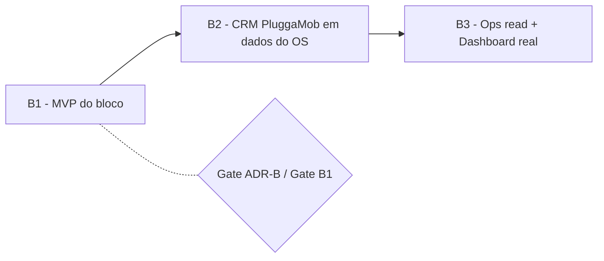
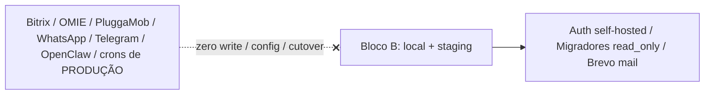

# ADR-0011 — Bloco B: ordem B1/B2/B3 e limites não negociáveis

- **Status:** Aceito
- **Data:** 2026-08-06
- **Decisores:** ARCHITECT (Bloco B), em alinhamento com ORCHESTRATOR
- **Bloco:** B — Auth real + Migradores read_only
- **Amarra:** ADR-0008 (auth), ADR-0009 (Bitrix Migrator), ADR-0010 (Brevo),
  ADR-0005/0006 (integrações/WhatsApp), ADR-0007 (jobs/auditoria)

## Contexto

O Bloco B tira o OS do stub/mock e o torna **utilizável em local → staging → VPS do
cliente**, com migração controlada de dados para o Postgres do OS — **sem
write/cutover em produção**. Vários workstreams (auth, e-mail, migradores, jobs, UI)
correm em paralelo; este ADR fixa a **ordem** e os **limites duros** que valem para
todos, para nenhum workstream cruzar uma linha por conta própria.

## Decisão

### Sequenciamento B1 → B2 → B3

| Fase | Escopo | Fora |
|---|---|---|
| **B1** | Auth real (ADR-0008); Brevo + Mailpit (ADR-0010); Bitrix Migrator read_only C7/C43/C0 (ADR-0009); `requested_by` humano (ADR-0007 emenda); BullMQ p/ jobs novos; UI login/Integrações/Migrador; testes unit + e2e login | WhatsApp real; write em qualquer sistema; CRM |
| **B2** | CRM PluggaMob (segmentos/fila) sobre dados do OS | **Sem WhatsApp real** |
| **B3** | PluggaMob Ops read + Dashboard/Pendências com `event_log` real | Write de produção |
| C+ | Financeiro fechamento, OPM write, Compras nativo, V2 Engenharia/Obras | — |

Dentro do B1, a **ordem de entrada** dos migradores (após auth+e-mail habilitarem o
uso) é: **Bitrix → PluggaMob → OMIE → PagBank (import de arquivo) → Telegram (card)
→ WhatsApp (no-op) → Brevo** (Brevo já habilitado por ser pré-requisito de auth).
Auth (B1) precede tudo que exige usuário real; e-mail precede convite/reset.

### Limites não negociáveis (valem para todos os workstreams)

1. **Zero write em produção.** Nenhum write/config/cutover/disparo em Bitrix, OMIE,
   PluggaMob/OCPP, PagBank, WhatsApp, Telegram, OpenClaw ou crons de produção.
   Migradores são **read_only por construção** (ADR-0009).
2. **WhatsApp permanece no-op.** `POST /channels/whatsapp/send` segue mock/no-op
   (ADR-0006). Sem SDK, sem rede a gateway real, sem gate LGPD+cutover neste bloco.
   Modelagem de canal + UI de log local é **opcional** e não envia nada.
3. **Cutover só por domínio, com gate + aprovação humana** (ADR-0005/0009). Nenhum
   domínio passa de `read_only` no Bloco B.
4. **Segredos só em `.env`/secret local — nunca no git** (credenciais de Bitrix,
   Brevo, auth). Nunca na tabela `integrations`; nunca em log/evento.
5. **Sem SaaS de identidade** (ADR-0008). Sem Supabase/Clerk/Auth0 como default.
6. **Jobs novos usam BullMQ + Redis** (ADR-0007); crons legados entram só como
   **inventário read-only** (Tela 25) — não são criados, pausados nem migrados.
7. **`DEV_AUTH_ENABLED` off por default fora de dev** (ADR-0008); proibido em
   produção (invariante do `environment.ts`).
8. **Sem Kafka/K8s/microserviços** (herdado do Bloco A).

### Ferramental

Só Cursor: **Opus 4.8** (arquitetura/review) + **Sonnet 5** (implementação/UI/e2e).
**Codex está proibido** neste bloco.

### Aceite B1 (resumo verificável)

- [ ] `docker compose up -d` + migrate + seed + API/Web pelo README
- [ ] Login real self-hosted (não header stub) em local
- [ ] Convite/reset via e-mail (Brevo ou Mailpit)
- [ ] Guard RBAC com papéis reais
- [ ] Bitrix como Migrador temporário na UI/docs
- [ ] ≥1 sync read_only Bitrix → DB local
- [ ] Zero write a Bitrix/WhatsApp/OMIE/produção
- [ ] `requested_by` preenchido no caminho humano; `NULL` para `service:`
- [ ] CI verde; ADRs do Bloco B commitados

## Consequências

**Positivas**
- Uma fonte única para a ordem e os limites; nenhum workstream precisa reinferir o
  que é permitido.
- Gate por fase e por domínio evita que "só um write pequeno" escape.

**Negativas / custos**
- Sequenciamento cria dependências (auth antes de tudo que usa usuário real); exige
  coordenação do ORCHESTRATOR. É custo aceito em troca de segurança.

**Neutras**
- WhatsApp/Telegram entram no B1 apenas como card/no-op; o peso real deles é de
  fases posteriores sob gate.

## Alternativas consideradas

| Alternativa | Por que **não** |
|---|---|
| Migradores e CRM em paralelo com auth ainda stub | Sem usuário real, `requested_by` e RBAC não têm como ser exercitados de verdade; retrabalho. |
| Habilitar 1 write "controlado" de produção no B1 | Contraria o limite duro; qualquer write exige gate+cutover por domínio (fase futura). |
| Ligar WhatsApp real "só para teste" | Proibido: sem provedor/LGPD/cutover fechados (ADR-0006). |

## Gatilhos de revisão

- Fim do B1 (aceite satisfeito) → planejar B2 (CRM) com seu próprio gate.
- Primeiro domínio pronto para bridge/cutover → decisão de fase por domínio
  (ADR-0009), fora deste ADR.
- Mudança de ferramental (ex.: novo modelo/agente) → atualizar a seção de
  ferramental.

## Guardas de escopo

- Este ADR não autoriza nenhum write/cutover; ele os **proíbe** no Bloco B.
- Nenhuma mensagem real de WhatsApp/Telegram sai no Bloco B.
- Nenhum segredo no repositório; nenhum SaaS de identidade.
